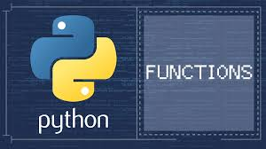

[![Contributors][contributors-shield]][contributors-url]
[![Forks][forks-shield]][forks-url]
[![Stargazers][stars-shield]][stars-url]
[![Issues][issues-shield]][issues-url]
[![LinkedIn][linkedin-shield]][linkedin-url]


<!-- PROJECT LOGO -->
<br />
<p align="center">
  <a href="https://git.nmlv.nml.com/JET5252/py-functions">
    
  </a>

  <h3 align="center">Python Functions</h3>

  <p align="center">
    Python functions for various data science tasks meant to reduce the need/dependency for data scientists/engineers to continually repeat tasks or develop bespoke functions for things that myself and other data scientists/engineers may have already done.
   
* Feature Engineering
* Unsupervised Feature Selection
* Supervised Feature Selection
* Data wrangling
* Visualization
* Modeling 

### Current Functions Built With

* [Pandas](https://pypi.org/project/pandas/)
* [Numpy](https://pypi.org/project/numpy/)
* [Pandas Flavor](https://pypi.org/project/pandas-flavor/)
* [DateTime](https://pypi.org/project/DateTime/)
* [Fast-ML](https://pypi.org/project/fast-ml/) 


<!-- GETTING STARTED -->
## Getting Started

To make best use of any (or all) of the functions in the repository it is strongly adviced that you (1) clone the repo, (2) have the requisite dependencies/libraries and (3) to method chain pandas specific functions have `pandas-flavor`, which is a (simple) API for registering accessors with Pandas objects that will enable you to make best use of the pandas-specific functions for your own work. Pandas-flavor extends Pandas' extension API by:

1. adding support for registering methods as well.
2. making each of these functions backwards compatible with older versions of Pandas.

To get a local copy up and running follow these simple example steps.

### Installation

1. Clone the repo
   ```sh
   git clone https://git.nmlv.nml.com/JET5252/py-functions.git
   ```
2. Install Pandas, Numpy, Pandas-Flavor, DateTime, Fast-ML
   ```sh
   pip install pandas
   pip install numpy
   pip install pandas-flavor
   pip install DateTime
   pip install fast-ml
   ```


lhttps://www.linkedin.com/company/northwestern-mutual/
[product-screenshot]: images/screenshot.png
